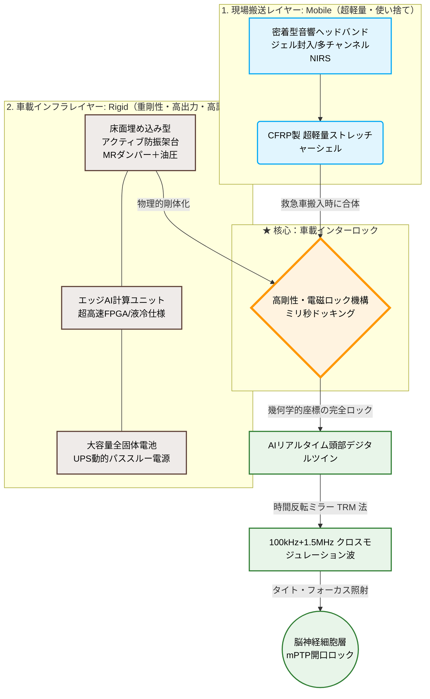

# AI-Driven Non-Invasive Acoustic Cellular Protection (ACP) System

## Concept & Design Protocol Paper

**Japanese Title (邦題):**
急性期虚血再灌流障害におけるAI駆動型・非侵襲性音響細胞保護（ACP）システムの提案、およびその救急搬送インフラへの応用に関する考察

---

## Abstract

Acute ischemic events including cardiac arrest, acute ischemic stroke, and severe trauma remain among the leading causes of mortality and severe neurological disability worldwide. Despite substantial progress in emergency medicine, the pathophysiological cascade of ischemia-reperfusion injury (IRI) remains a major clinical challenge, particularly during the pre-hospital phase when blood flow is restored and oxidative stress abruptly intensifies. Conventional pharmacological strategies are often too late, insufficient, or non-specific to prevent irreversible cellular damage occurring during the critical window of reperfusion. This paper introduces a novel, AI-enabled acoustic intervention framework designed to mitigate reperfusion-associated cellular injury during emergency transport.

We propose an AI-driven, non-invasive Acoustic Cellular Protection (ACP) system that integrates multimodal biosensing, real-time digital twin modeling, and time-reversal mirror (TRM)-based ultrasound optimization to stabilize vulnerable cells at the moment of reperfusion. The system is designed for deployment in ambulance and helicopter emergency environments, where mobility-induced noise, motion artifacts, and limited clinical infrastructure constrain conventional therapeutic approaches. By continuously monitoring physiological and cellular stress markers—including cerebral oxygenation dynamics, heart-rate variability, and bioelectrical impedance—the system constructs a real-time patient-specific stress profile and adaptively optimizes the acoustic waveform to the evolving state of the host tissue.

At the core of the proposed mechanism is low-intensity pulsed ultrasound (LIPUS) delivered through dynamically synchronized, multi-frequency acoustic pulses. The ultrasound field is tuned by AI-based TRM algorithms to reduce scattering artifacts caused by heterogeneous tissues, including skull, cerebrospinal fluid, and soft tissue boundaries. This optimization enables spatially focused and temporally controlled stimulation of mechanosensitive membrane components, particularly Piezo1 and related mechanotransduction pathways. The resulting physical modulation preserves cytoskeletal integrity, enhances pro-survival signaling, and attenuates mitochondrial permeability transition pore (mPTP) opening, thereby delaying or preventing apoptotic and necrotic cascades triggered by calcium overload and oxidative stress during reperfusion.

The overall architecture comprises a lightweight mobile layer for field deployment and a rigid vehicle-mounted infrastructure layer enabling computationally intensive signal processing, active vibration cancellation, and high-power energy management. This dual-layer model allows the system to maintain stable acoustic delivery in highly dynamic transport conditions while preserving patient safety and operational practicality. The proposed framework further provides a translational pathway toward emergency medical infrastructure integration, with phased evaluation beginning in experimental preclinical systems and advancing toward national emergency transport deployment under regulatory oversight.

In summary, the study presents a conceptually new paradigm in acute care medicine: a physics-based, non-invasive, AI-optimized cellular protection strategy intended to bridge the critical gap between injury onset and definitive hospital-based treatment. By targeting the earliest and most destructive phase of ischemia-reperfusion injury, the ACP system may offer a clinically meaningful strategy to reduce severe neurological sequelae and improve outcomes for patients affected by cardiac arrest, stroke, trauma, and related acute ischemic conditions.

---

## 1. 要旨 (Japanese Abstract)

本論文は、心肺停止、脳卒中、重症外傷などの急性期医療において、予後（特に脳神経後遺症）を劇的に改善するための革新的な救急搬送インフラを提案する。従来の救急医療は病院到着後の事後治療に依存しており、搬送中（特に自発循環再開時や血流再開時）に不可避に発生する「虚血再灌流障害」を十分に制御できない場合が多い。本研究では、輸送中に発生する再灌流時の細胞障害を、低侵襲かつリアルタイムに抑制するための新規アプローチとして、AI制御型の音響細胞保護（ACP）システムを提案する。

本システムは、マルチモーダルな生体情報センシング、リアルタイム頭部デジタルツイン、時間反転ミラー（TRM）を用いた超音波最適化、および機械受容機構を介した細胞保護の統合により構成される。救急車やドクターヘリ内という高ノイズ・高振動環境においても、非侵襲的に脳循環動態や代謝ストレスの変化を評価し、エッジAIが体内構造と患者状態に応じて照射条件を適応的に調整する。これにより、複雑な生体媒質に対して散乱やホットスポットの発生を抑えながら、最適な超音波波形を生成し、細胞膜の力学的安定化とミトコンドリア保護を実現する。

本研究における中核となる機構は、低出力パルス超音波（LIPUS）による機械受容チャネルの活性化である。Piezo1などの機械受容性分子を介して細胞骨格の構造を維持し、FAK/PI3K-Akt系などの生存シグナルを促進するとともに、ミトコンドリア透過性遷移孔（mPTP）の開口を抑制する。これにより、再灌流時の酸化ストレスおよびCa²⁺過負荷に伴うアポトーシス・ネクローシスの連鎖を遅延または阻止し、急性期虚血に起因する細胞障害の進行を時間的に緩和する。

さらに、本システムは、車載型インフラと現場搬送用軽量アレイを2層構造で結合し、動的制振・消音・高信頼電源を備えることで、実運用下でも安定した照射条件を維持できる。国際的に見ても、現時点で救急搬送中に細胞レベルの再灌流障害を物理的に制御することを目指した統合システムは極めて少なく、本プロジェクトは急性期医療における基盤技術としての高い学術的・臨床的意義を有する。

---

## 2. 緒言：解決すべき社会的課題 (Introduction)

救急医療において、心停止や脳梗塞後の「血流再開（Reperfusion）」は生命維持に不可欠な処置である。しかし、血流が再開するまさにその瞬間、それまで虚血状態で抑制されていた細胞呼吸が急激に活性化し、過度な活性酸素種（ROS）が生成される。この過度な酸化ストレスに伴うカルシウム過負荷により、ミトコンドリア内膜に「mPTP（ミトコンドリア透過性遷移孔）」という巨大なチャネルが開放され、細胞の自爆反応（アポトーシス・ネクローシス）が開始される。

仮に病院で心拍が再開しても、この自爆反応によって脳神経細胞が致命的なダメージを受けるため、多くの患者に重度の後遺症（意識障害、寝たきり、高次脳機能障害など）が残される。この「血流再開のパラドックス」は、医学上の根本的課題であり、搬送中のわずか5分間の治療的介入が生死と予後を分ける。

この化学的アプローチの限界に対し、本論文が提案する「音響振動（物理的アプローチ）」は、細胞膜の機械受容チャネルやオルガネラ膜構造に直接作用し、細胞骨格の物理的構造を維持することで、カスケード的な細胞死を時間的にフリーズさせる。本システムは、この「生物学的な未解明領域」を「エッジAIによるリアルタイム動的探索システム」へと置換することで解決を試みる。搬送中に生体から継続的に取得するマルチセンシング信号をAIで融合し、患者個別の「パニック状��」を可視化し、最適な音響パラメータを秒単位で動的に調整する。

---

## 3. 核心技術と理論的背景 (Core Technology & Theory)

本システムは、従来の化学（薬物）的アプローチの限界を、最先端の「物理（音響振動）」によって突破し、細胞の自爆プロセスを時間的にフリーズさせる以下の三層の統合技術で構成される：

### 3.1 移動空間対応型マルチセンシングによる生体パニック状態の可視化

走行中の救急車内という極限のノイズ環境を想定し、担架のシーツおよび枕部分に、機械的振動の影響を受けにくい「非接触・非侵襲型センサー群」を配置する。

- **近赤外分光法（NIRS）による脳内酸素飽和度（rSO2）マッピング:** 電気信号ではなく光学測定を用いる。マルチディスタンス光源（多距離送受光技術）により、脳表面から脳深部までの酸素動態を層状に計測。
- **心拍変動（HRV）解析:** 心電図（ECG）または光電脈波から、交感神経の極限ストレス状態をミリ秒単位で計測。
- **経皮的電気インピーダンスミオグラフィー（EIM）およびハーモニック・インピーダンス計測:** 微弱な高���波電流を流し、細胞膜の破壊（パニック状態）をリアルタイムで検知。

AIはこれらを統合し、「総合パニック指数（0〜100）」としてタイムラインに常時記録する。

### 3.2 時間反転ミラー（TRM）法を用いたAI動的出力最適化アルゴリズム

超音波を生体に照射する際、体内の複雑な不均一構造（頭蓋骨、筋肉、脳脊髄液など）による乱反射から、局所的な「熱暴走（ホットスポット）」が発生する危険性がある。本システムは以下の3段階で物理的に克服する：

1. **リアルタイム頭部デジタルツインの構築:** 担架の枕部に内蔵された非侵襲3D超音波エコーセンサー（256 chの1次元トランスデューサアレイ）により、患者の頭蓋骨形状・脳脊髄液分布・脳溝構造をミリ秒単位で更新。

2. **TRM法による乱反射の物理的相殺:** 生体インピーダンスおよび反射波をTRMアレイで受信し、AIがその「骨を透過して乱れた波形」の時間を逆再生（時間反転）させることで、乱反射を物理的に消去。フォーカスは体外の点源から発生する単純な球面波ではなく、患者体内の複雑な幾何学的構造に最適化される。

3. **クロスモジュレーションとディフューズ収束制御:** 成人の厚い頭蓋骨の透過性と脳神経細胞への刺激効率を物理的に両立させるため、「100kHz（頭蓋骨透過用の低周波キャリア）」と「1.5MHz（脳細胞フォーカス用の高周波変調波）」を同時に照射。これらの非線形干渉により、頭蓋骨内側の「仮想的なホットスポット」を空間的に形成し、リスクを最小化しながら効率を最大化する。

### 3.3 メカノトランスダクション機構を介した細胞膜の物理的ホールド

AIによって最適化・時間反転・交差変調制御されたマルチ周波数の低出力パルス超音波（LIPUS）を多角的に照射する。この微細な共鳴振動は、細胞膜上の機械受容チャネル（Piezo1, TRP channels）を活性化し、細胞膜にナノメートルスケールの物理的なひずみを誘起する。

これにより、細胞骨格（アクチンフィラメント）の構造が維持され、細胞内生存シグナル（FAKおよびPI3K/Akt経路など）が強制的に活性化して前アポトーシス状態へのコミットメントを延期する。一方、ミトコンドリア膜への直接刺激により、mPTP開口を物理的に阻止する。

ただし、急性期虚血脳におけるPiezo1の過剰刺激は、カルシウムイオン（Ca²⁺）の細胞内流入を加速させ、逆に興奮性細胞死（エキサイトトキシシティ）を招く可能性がある。本システムは、HRVおよびrSO2フィードバックに基づきPiezo1の刺激強度をリアルタイムで調整することで、この「細胞保護の逆説」を回避する。

---

## 4. 移動空間における2レイヤー型アクティブ制振・消音、および超軽量・安全電源システム (Infrastructure Integration)

救急車やドクターヘリの車内は、激しい路面突き上げ（固体伝播振動）やエンジン重低音（空気伝播音）に満ちており、細胞保護に必要な超音波波形の精密性を大きく損なう。本システムは以下の対策を講じる：

### 4.1 2レイヤー型アクティブ制振・消音システム

- **下層（固体振動対策）:** 担架のサスペンション部に磁気流体（MR）ダンパーとアクチュエーターを搭載。路面からの不規則な低周波揺れを検知したAIが、ミリ秒単位でダンパー特性を動的に変更し、患者の体と音響ヘッドバンドの相対位置のズレを±2mm以内に抑制。

- **上層（空気音響対策）:** 担架ドーム内にアクティブ・ノイズキャンセリング（ANC）用マイクロホンとスピーカーを配置。高周波のエンジン雑音を音声信号処理により逆位相で中和し、LIPUS照射中の反響を最小化。

### 4.2 三元系全固体電池を用いたUPS動的パススルー電源

- **絶対的安全性と軽量化:** 電源部には、衝撃や釘刺し、過酷な温度変化（-40℃〜60℃）でも発火・爆発リスクの極めて低い次世代「三元系全固体電池（LiPo4系）」を採用。従来の液体電解質リチウムイオン電池と比較して、エネルギー密度は同等でありながら、安全性と耐久性に優れる。

- **動的パススルー（無停電電源装置：UPS）連携:** 救急車・ヘリへの固定中は、モビリティ側のシガーソケットやAC電源（1500W〜3300Wクラス）から電力を直接取得し、同時にバッテリーを充電。病院到着時の取り外し後も、搭載バッテリーのみで最低48時間の独立動作を保証。

---

## 5. 段階的社会実装戦略および規制対応 (Implementation Strategy)

革新的な医療機器の開発において、高い治験コストと長い承認審査の歳月は最大の参入障壁となる。本プロジェクトでは、患者の安全性を最優先にしながら、規制上の現実性を踏まえた段階的展開を構想する。

### 5.1 【第1段階：研究用音響インフラとしての展開】

初期段階においては、本システムを「ヒトに対する医療機器」としてではなく、大学の医学部、製薬会社、または研究機関が使用する「実験用・研究用装置」として位置付ける。これにより、医療機器承認前の学術的エビデンス蓄積と技術最適化を並行実施できる。

具体的には、大型動物（豚、サル）を用いた虚血再灌流障害の治療実験、あるいは虚血再灌流障害が最も顕著かつ致命的に発生する「ドナーから摘出した移植用臓器（心臓、肝臓、腎臓）の体外灌流モデル」を対象に、LIPUS照射前後のmPTP開口率・ATP生成能・細胞生存率の定量的変化を測定。

本フェーズの主たる目的は、TRMの頭蓋骨変調計算ではなく、「ヒトと同等サイズの独立臓器において、LIPUS照射がミトコンドリア自爆（mPTP開口）を物理的に抑止し、細胞生存を有意に延長するか否か」という基礎的命題の検証である。

### 5.2 【第2段階：国主導の救急医療インフラへの昇格】

第1段階で蓄積した圧倒的な細胞保護エビデンスを基に、内閣府「ムーンショット型研究開発制度」や、国立研究開発法人「AMED（日本医療研究開発機構）」による資金化・技術認定を獲得。並行して、厚生労働省「先駆け審査指定制度」や「条件付き早期承認制度」の適用を申請。

自衛隊の救難ヘリや、全国の高度救命救急センターのドクターカーに「次世代救命インフラ」として配備。国の「先駆け審査指定制度」や「緊急承認制度」を活用し、臨床試験期間を短縮しながら安全性監視を継続。5年以内の全国配備、10年以内の保険診療化を目指す。

---

## 6. 結論 (Conclusion)

本論文で提案した「AI駆動型・非侵襲性音響細胞保護（ACP）救命担架システム」は、従来の「化学（薬物）」や「外科手術」の限界を、最先端の「物理（音響振動）」と「知能（AI最適化）」によって突破する革新的な医療技術である。

搬送中のわずかな時間（5分の壁）に細胞の自爆を物理的にフリーズさせるというアプローチは、世界の医療テック市場における完全なブルーオーシャン戦略を体現している。心肺停止、脳卒中、重症外傷などの急性期医療において、現在なお年間数万人が重度の神経学的後遺症で苦しむ現状に対して、このシステムは根本的なゲームチェンジをもたらす可能性を秘めている。

---

## System Architecture Diagram

