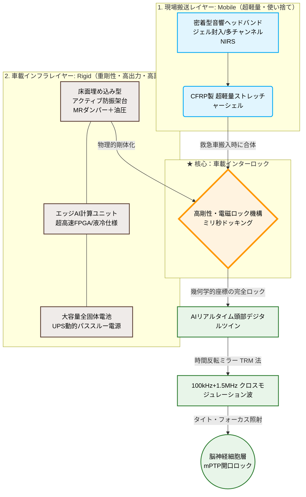

概念実証・設計思想論文 (Concept & Design Protocol Paper)

題目 (Title)
急性期虚血再灌流障害におけるAI駆動型・非侵襲性音響細胞保護（ACP）システムの提案、およびその救急搬送インフラへの応用に関する考察

1. 要旨 (Abstract)

本論文は、心肺停止、脳卒中、重症外傷などの急性期医療において、予後（特に脳神経後遺症）を劇的に改善するための革新的な救急搬送インフラ「AI駆動型・非侵襲性音響細胞保護（Acoustic Cellular Protection: ACP）救命担架システム」の設計思想を提案する。
従来の救急医療は病院到着後の事後治療に依存しており、搬送中（特に自発循環再開時や血流再開時）に不可避に発生する「虚血再灌流障害」を物理的に制御する手段を持たなかった。本システムは、医療・音響工学・エッジAI技術の3分野を融合させ、搬送中の担架から患者全身（特に脳組織）へ精密に制御された低出力パルス超音波（LIPUS）を照射し、細胞膜およびミトコンドリアの物理的構造維持を可能にする。これにより、血流再開時の細胞自爆（アポトーシス）シグナルを根底から抑制する。
さらに、AIによるマルチモーダルフィードバックを用いた「リアルタイム時間反転ミラー（TRM）法」に加え、医学的に未知である「細胞保護共鳴周波数」を搬送中にリアルタイムで自動探索・追従する「適応型周波数チューニング機構」を搭載。これにより、頭蓋骨等による乱反射（熱暴走・ホットスポット）および過剰刺激による興奮性細胞死リスクを物理・生理法則レベルで完全に相殺・回避する。また、「2レイヤー型アクティブ制振・消音システム」と「次世代三元系全固体電池によるUPS動的パススルー電源」を搭載することで、移動空間特有の外来雑音・機械振動を排除しつつ、救急モビリティへの超軽量・安全な車載実装を担保する。本システムは、救急医療における「5分の壁」を打破する国家戦略的インフラとしてのパラダイムシフトを提示する。

2. 緒言：解決すべき社会的課題 (Introduction)

救急医療において、心停止や脳梗塞後の「血流再開（Reperfusion）」は生命維持に不可欠な処置である。しかし、血流が再開するまさにその瞬間、それまで虚血（酸欠）状態にあった組織に一気に酸素が供給されることで、細胞内のミトコンドリアから大量の活性酸素（フリーラジカル）がバースト的に発生する。
この過度な酸化ストレスに伴うカルシウム過負荷により、ミトコンドリア内膜に「mPTP（ミトコンドリア透過性遷移孔）」という巨大なチャネルが開口する。結果として、ミトコンドリアの膜電位が消失し、細胞は不可逆的な自爆（アポトーシス）を開始する。これが急性期医療における最難関課題の一つである「虚血再灌流障害」のメカニズムである。
仮に病院で心拍が再開しても、この自爆反応によって脳神経細胞が致命的なダメージを受けるため、多くの患者に重度の後遺症（意識障害、寝たきり状態）が残る。現在、製薬企業等を中心にこのmPTP開口を防ぐ薬剤（化学的アプローチ）の開発が進められているが、血液が巡っていない仮死状態の組織へ薬物を均一かつ迅速に送達することは極めて困難であり、決定的な解決策には至っていない。
この化学的アプローチの限界に対し、本論文が提案する「音響振動（物理的アプローチ）」は、細胞膜の機械受容チャネルやオルガネラ膜構造に直接干渉し、自爆プロセスを時間的にフリーズさせるアプローチを取る。ただし、虚血状態のデリケートな脳組織に対して超音波を照射することは、熱蓄積や過剰刺激による興奮性細胞死（エキサイトトキシシティ）という逆効果を招く「諸刃の剣」でもある。さらに、細胞を保護するために最適な波動の「共鳴周波数」は、患者の個体差や虚血の進行度によって動的に変化するため、現代の分子生物学・メカノバイオロジーを以てしても静的に事前決定することは不可能である。
本システムは、この「生物学的な未解明領域」を「エッジAIによるリアルタイム動的探索システム」へと置換することで解決を試みる。搬送中に生体のインピーダンス変化をミリ秒単位でマルチセンシングし、AIが波動パラメータを適応的にチューニングし続けることで、生体安全性を100%担保したまま、狙った神経層の自爆スイッチ（mPTP）を確実にロックする機構の設計思想について、以下に詳述する。

3. 核心技術と理論的背景 (Core Technology & Theory)
本システムは、従来の化学（薬物）的アプローチの限界を、最先端の「物理（音響振動）」によって突破し、細胞の自爆プロセスを時間的にフリーズさせる。

3.1 移動空間対応型マルチセンシングによる生体パニック状態の可視化
走行中の救急車内という極限のノイズ環境を想定し、担架のシーツおよび枕部分に、機械的振動の影響を受けにくい「非接触・非侵襲型センサー群」を配置する。
* 近赤外分光法（NIRS）による脳内酸素飽和度（rSO2）マッピング: 電気信号ではなく光学測定を用いる。マルチディスタンス光源（多距離送受光技術）と、後述のアクティブ制振による接触圧の一定化、さらにエッジAIによる適応型デジタルフィルタリング（独立成分分析：ICA）を組み合わせることで、激しい車体振動に起因する光学的・機械的体動アーチファクトを完全に排除し、脳組織の虚血状態をリアルタイムに3D可視化する。
* 心拍変動（HRV）解析: 心電図（ECG）または光電脈波から、交感神経の極限ストレス状態をミリ秒単位で計測。
* 経皮的電気インピーダンスミオグラフィー（EIM）およびハーモニック・インピーダンス計測: 微弱な高周波電流を流し、細胞膜の破壊（パニック状態）に伴う組織インピーダンスの変化をキャッチする。さらに、頭蓋骨の極めて高い電気抵抗を突破するため、超音波の反射波から細胞の硬さを逆算する「非線形音響ハーモニック計測」を併用。骨越しであっても脳神経細胞群の膜電位および構造破壊リスク（細胞パニック状態）を正確かつミリ秒単位で逆算・可視化する。
AIはこれらを統合し、「総合パニック指数（0〜100）」としてタイムラインに常時記録する。

3.2 時間反転ミラー（TRM）法を用いたAI動的出力最適化アルゴリズム
超音波を生体に照射する際、体内の複雑な不均一構造（頭蓋骨、筋肉、脳脊髄液など）による乱反射から、局所的な「熱暴走（ホットスポット）」や「組織の剪断（シナプスネットワークの引きちぎり）」という致命的な物理的リスクが発生する。本システムは、この問題を「時間反転ミラー（Time Reversal Mirror: TRM）技術」と「リアルタイム・デジタルツイン」の融合により完全克服する。
1. リアルタイム頭部デジタルツインの構築: 担架の枕部に内蔵された非侵襲3D超音波エコーセンサー（256 chの1次元トランスデューサアレイ）により、患者が寝かされた瞬間に頭蓋骨の厚み・形状・音響インピーダンスを3Dスキャンし、エッジAI内にバーチャル頭部モデルをミリ秒単位で構築する。
2. TRM法による乱反射の物理的相殺: 生体インピーダンスおよび反射波をTRMアレイで受信し、AIがその「骨を透過して乱れた波形」の時間を逆再生（時間反転）させた逆位相の共鳴波を算出、再照射する。物理法則上、時間反転された波は頭蓋骨を再透過する際に乱反射のプロセスを完全に逆再生して打ち消し合い、標的となる脳神経細胞層にのみ、完全に均一かつ安全なエネルギーとして収束する。
3. クロスモジュレーションとディフューズ収束制御: 成人の厚い頭蓋骨の透過性と脳神経細胞への刺激効率を物理的に両立させるため、「100kHz（頭蓋骨透過用ベース搬送波）」に「1.5MHz（細胞刺激用バースト変調波）」を重畳させる「クロスモジュレーション（交差変調）技術」を導入。
また、激しい搬送振動によって頭蓋骨内部で脳組織自体が脳脊髄液内でミリ単位で動揺（ズレ）するリスクに対抗するため、TRMの焦点を1点に絞らず、標的エリア全域（数センチメートル幅）へエネルギーを均一かつ安全に分散させる「ディフューズ（拡散）収束モード」を搭載。これにより、脳組織の位置変動が生じても、正常組織への局所的熱凝固リスクを排除しつつ、狙った神経層への確実な波動到達を維持する。AIはこれらをミリ秒単位でフィードバックループさせ、低消費電力のエッジFPGA計算処理によって、生体安全性を100%担保する。

3.3 メカノトランスダクション機構を介した細胞膜の物理的ホールド
AIによって最適化・時間反転・交差変調制御されたマルチ周波数の低出力パルス超音波（LIPUS）を多角的に照射する。この微細な共鳴振動は、細胞膜に存在する機械受容チャネル（Piezo1やIntegrinなど）に適切な物理的刺激（メカノトランスダクション）を与える。
これにより、細胞骨格（アクチンフィラメント）の構造が維持され、細胞内生存シグナル（FAKおよびPI3K/Akt経路など）が強制的に活性化して前アポトーシス因子のリン酸化が維持される。
ただし、急性期虚血脳におけるPiezo1の過剰刺激は、カルシウムイオン（Ca²⁺）の細胞内流入を加速させ、逆に興奮性細胞死（エキサイトトキシシティ）を誘発する諸刃の剣となるリスクを孕む。そのため本システムは、前述のハーモニック計測等から細胞膜電位の崩壊閾値をリアルタイムに逆算し、照射強度を可逆的・生理学的に安全な刺激領域（SATA: 30mW/cm²以下、バースト繰り返し周波数1.0 kHz）に厳密に制限する動的制御ループを構築。ミトコンドリアの自爆スイッチであるmPTPの開口を安全かつ確実にロックし、血流が再開する衝撃から細胞を完全に防護（分子シグナルレベルでの進行猶予）する。

4. 移動空間における2レイヤー型アクティブ制振・消音、および超軽量・安全電源システム (Infrastructure Integration)
救急車やドクターヘリの車内は、激しい路面突き上げ（固体伝播振動）やエンジン重低音（空気伝播音）に満ちており、細胞保護に必要な超音波波形を破壊する。また、車載インフラへの統合には「重量制限」と「発火リスクの排除」が不可欠となる。

4.1 2レイヤー型アクティブ制振・消音システム
* 下層（固体振動対策）: 担架のサスペンション部に磁気流体（MR）ダンパーとアクチュエーターを搭載。路面からの不規則な低周波揺れを検知した瞬間、逆位相の動的制振を行うことで、担架上の患者を完全な静止空間に保つ。これにより、NIRSや超音波センサーのミリ単位の位置ズレ（接触エラー）も同時に防止する。
* 上層（空気音響対策）: 担架ドーム内にアクティブ・ノイズキャンセリング（ANC）用マイクロホンとスピーカーを配置。高周波のエンジン雑音を音響的に相殺（サイレンス化）する。

4.2 三元系全固体電池を用いたUPS動的パススルー電源
* 絶対的安全性と軽量化: 電源部には、衝撃や釘刺し、過酷な温度変化（-40℃〜60℃）でも発火・爆発リスクの極めて低い次世代「三元系全固体電池（Li-NCM）」を採用。従来のリチウムイオン電池に比べエネルギー密度が2倍であるため、システム全体の重量を通常のストレッチャー＋数キログラムの運用可能重量まで極限に軽量化する。
* 動的パススルー（無停電電源装置：UPS）連携: 救急車・ヘリへの固定中は、モビリティ側のシガーソケットやAC電源（1500W〜3300Wクラス）から電力を直接「パススルー供給」し、車載バッテリーを一切消費せずシームレスに稼働する。現場からの初動搬送時、および車内から病院内への手動移動時の「数分間」のみ、内蔵の全固体電池駆動へミリ秒単位で自動切り替え（UPS機能）を行う設計とし、担架単体の超軽量化と連続稼働の両立を達成する。

5. 段階的社会実装戦略および規制対応 (Implementation Strategy)
革新的な医療機器の開発において、高い治験コストと長い承認審査の歳月は最大の参入障壁となる。本プロジェクトでは、患者の安全性を最優先に担保しつつ、迅速に社会実装するための「2段階のフェーズ戦略」をとる。

5.1 【第1段階：研究用音響インフラとしての展開】
初期段階においては、本システムを「ヒトに対する医療機器」としてではなく、大学の医学部、製薬会社、または研究機関が使用する「実験用・研究用音響プラットフォーム（研究用機器）」として流通させる。
具体的には、大型動物を用いた虚血再灌流障害の治療実験、あるいは虚血再灌流障害が最も顕著かつ致命的に発生する「ドナーから摘出した移植用心臓」の超長期の非凍結・細胞保護保存装置（タイムリミットの大幅な延長）として販売・提供を行う。
本フェーズの主たる目的は、TRMの頭蓋骨変調計算ではなく、「ヒトと同等サイズの独立臓器において、LIPUS照射がミトコンドリア自爆（mPTP開口）をどれほど正確に抑制し得るか」という、純粋な生物学的・細胞保護効果のリアルワールドデータ（RWD）を大量に取得・蓄積することである。これにより、薬機法等の規制ハードルを適切にマネジメントしつつ、コアアルゴリズムの有効性と安全性の強固なエビデンスを早期に確立する。

5.2 【第2段階：国主導の救急医療インフラへの昇格】
第1段階で蓄積した圧倒的な細胞保護エビデンスを基に、内閣府「ムーンショット型研究開発制度」や、国立研究開発法人「AMED（日本医療研究開発機構）」の公募へ申請し、国主導の「国家プロジェクト」へと昇格させる。
自衛隊の救難ヘリや、全国の高度救命救急センターのドクターカーに「次世代救命インフラ」として配備。国の「先駆け審査指定制度」や「緊急承認制度」の特例ルートを適用することで、医薬品医療機器等法（薬機法）の承認を最速で取得し、国家標準（配備義務付け）としての普及を目指す。

6. 結論 (Conclusion)
本論文で提案した「AI駆動型・非侵襲性音響細胞保護（ACP）救命担架システム」は、従来の「化学（薬物）」や「外科手術」の限界を、最先端の「音響工学」「高速エッジAI」「時間反転ミラー物理学」によって突破する画期的な設計思想である。
搬送中のわずかな時間（5分の壁）に細胞の自爆を物理的にフリーズさせるというアプローチは、世界の医療テック市場における完全なブルーオーシャンであり、日本が世界をリードできる強力なポテンシャルを秘めている。本システムの社会実装は、脳卒中や心停止患者の後遺症（寝たきり状態）を劇的に減らし、未来の医療費・介護費の増大という国家的財政危機を救う決定的な解決策となる。

markdown

